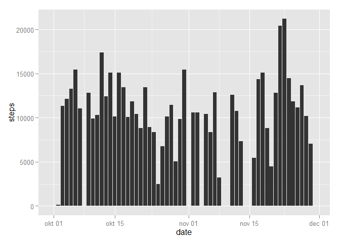
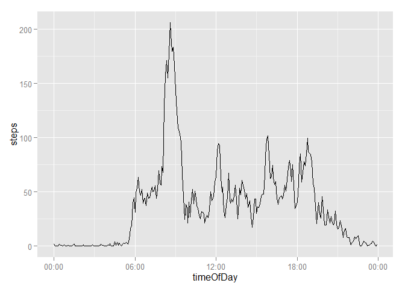
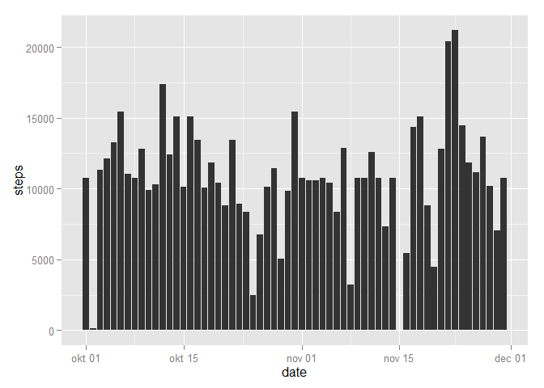
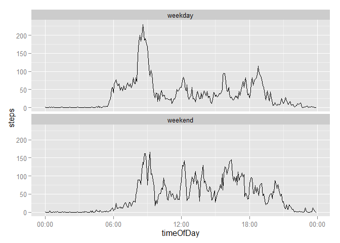

# Reproducible Research: Peer Assessment 1


## Loading and preprocessing the data
Load the requred libraries

```r
library(lubridate)
library(dplyr)
library(ggplot2)
library(scales)
```
Unzip and read the csv file.

```r
data <- read.csv(unz("activity.zip", "activity.csv"), colClasses = c("numeric", "Date", "numeric"))
head(data)
```

```
##   steps       date interval
## 1    NA 2012-10-01        0
## 2    NA 2012-10-01        5
## 3    NA 2012-10-01       10
## 4    NA 2012-10-01       15
## 5    NA 2012-10-01       20
## 6    NA 2012-10-01       25
```

Add a field which is the interval converted to the time of day on an arbitrary date. Then remove the interval field

```r
data$timeOfDay <- ISOdate(0, 1, 1, data$interval %/% 100, data$interval %% 100)
data <- data[, -3]
head(data)
```

```
##   steps       date           timeOfDay
## 1    NA 2012-10-01 0000-01-01 00:00:00
## 2    NA 2012-10-01 0000-01-01 00:05:00
## 3    NA 2012-10-01 0000-01-01 00:10:00
## 4    NA 2012-10-01 0000-01-01 00:15:00
## 5    NA 2012-10-01 0000-01-01 00:20:00
## 6    NA 2012-10-01 0000-01-01 00:25:00
```

## What is mean total number of steps taken per day?
Calculate the total number of steps per day (excluding missing values)

```r
stepsPerDay <-
    data %>%
    group_by(date) %>%
    summarize(steps = sum(steps, na.rm = TRUE))
```

The following histogram shows the total number of steps taken on each day

```r
ggplot(stepsPerDay) + geom_histogram(aes(x=date, y=steps), stat = "identity")
```

 

Calculation of the average and median total number of steps per day (still excluding missing values)

```r
mean(stepsPerDay$steps)
```

```
## [1] 9354.23
```

```r
median(stepsPerDay$steps)
```

```
## [1] 10395
```

## What is the average daily activity pattern?

```r
stepsPerInterval <-
    data %>%
    group_by(timeOfDay) %>%
    summarize(steps = mean(steps, na.rm = TRUE))
    
ggplot(stepsPerInterval) + 
    geom_line(aes(x=timeOfDay, y=steps), stat = "identity") +
    scale_x_datetime(labels = date_format("%H:%M"))
```

 

The interval which on average contains the largest number of steps is between 08:35 and 08:40

```r
format(stepsPerInterval[stepsPerInterval$steps == max(stepsPerInterval$steps), "timeOfDay"], "%H:%M")
```

```
##   timeOfDay
## 1     08:35
```

## Imputing missing values
Total number of missing values:

```r
sum(is.na(data$steps))
```

```
## [1] 2304
```

Impute missing values. The mean value for the specific time of day, taken over the full dataset, is used for filling in the missing values.


```r
data <- inner_join(data, stepsPerInterval, by = "timeOfDay")
data[is.na(data$steps.x), "steps.x"] <- data[is.na(data$steps.x), "steps.y"]
data <- data[, -4]
colnames(data) <- c("steps", "date", "timeOfDay")
head(data)
```

```
##       steps       date           timeOfDay
## 1 1.7169811 2012-10-01 0000-01-01 00:00:00
## 2 0.3396226 2012-10-01 0000-01-01 00:05:00
## 3 0.1320755 2012-10-01 0000-01-01 00:10:00
## 4 0.1509434 2012-10-01 0000-01-01 00:15:00
## 5 0.0754717 2012-10-01 0000-01-01 00:20:00
## 6 2.0943396 2012-10-01 0000-01-01 00:25:00
```
Calculate the total number of steps per day (with imputed values)

```r
stepsPerDay <-
    data %>%
    group_by(date) %>%
    summarize(steps = sum(steps, na.rm = TRUE))
```

The following histogram shows the total number of steps taken on each day

```r
ggplot(stepsPerDay) + geom_histogram(aes(x=date, y=steps), stat = "identity")
```

 

Calculation of the average and median total number of steps per day (still with imputed values)

```r
mean(stepsPerDay$steps)
```

```
## [1] 10766.19
```

```r
median(stepsPerDay$steps)
```

```
## [1] 10766.19
```
Both the mean and median value are different from the original values when missing values are imputed.

## Are there differences in activity patterns between weekdays and weekends?

```r
data$weekday <- as.factor(weekdays(data$date))
levels(data$weekday)
```

```
## [1] "fredag"  "lørdag"  "mandag"  "onsdag"  "søndag"  "tirsdag" "torsdag"
```

```r
levels(data$weekday) <- c("weekday", "weekend", "weekday", "weekday", "weekend", "weekday", "weekday")
head(data)
```

```
##       steps       date           timeOfDay weekday
## 1 1.7169811 2012-10-01 0000-01-01 00:00:00 weekday
## 2 0.3396226 2012-10-01 0000-01-01 00:05:00 weekday
## 3 0.1320755 2012-10-01 0000-01-01 00:10:00 weekday
## 4 0.1509434 2012-10-01 0000-01-01 00:15:00 weekday
## 5 0.0754717 2012-10-01 0000-01-01 00:20:00 weekday
## 6 2.0943396 2012-10-01 0000-01-01 00:25:00 weekday
```

```r
stepsPerInterval <-
    data %>%
    group_by(timeOfDay, weekday) %>%
    summarize(steps = mean(steps, na.rm = TRUE))

ggplot(stepsPerInterval) + 
    geom_line(aes(x=timeOfDay, y=steps), stat = "identity") +
    facet_wrap(~ weekday, ncol = 1) +
    scale_x_datetime(labels = date_format("%H:%M"))
```

 
